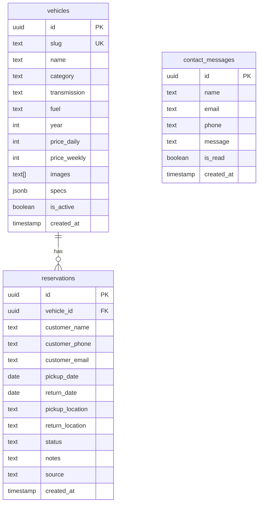
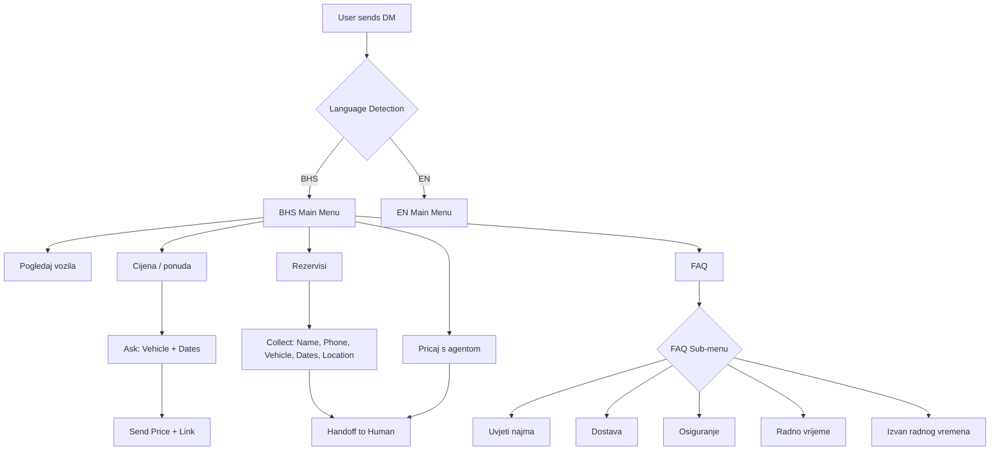

# Implementation Plan: SV Cars — Website Redesign & Instagram Chatbot

> **Status:** Draft
> **Created:** 2026-04-24
> **Scope:** Full website redesign (premium dark theme, Next.js) + Supabase reservation system + Instagram DM chatbot automation for SV Cars rent-a-car, Mostar

---

## 🎯 Goal

Rebuild the SV Cars website from scratch as a modern, premium-branded Next.js application with a dark cinematic theme, multi-language support, and a **Supabase-powered reservation system** with real-time availability tracking. Simultaneously, deploy an Instagram DM chatbot (via ManyChat) to automate customer inquiries and reduce lead loss from slow manual responses. The end result: more direct reservations, stronger brand perception, and less manual work for the owner.

---

## 📋 Requirements

### Functional
- [ ] Premium dark-themed responsive website (mobile-first)
- [ ] Homepage with hero ("RENT YOUR DREAM"), USP icons, featured vehicles, about section, services, FAQ, footer
- [ ] Vehicle listing page with filters (type, transmission, fuel, price)
- [ ] Individual vehicle detail pages with gallery, specs, pricing tiers (daily + 7+ days), and reservation CTA
- [ ] **Supabase-powered reservation system** — form submission, availability checking, admin dashboard
- [ ] Services page (personal vehicles, quads, delivery, long-term rental)
- [ ] About page, Terms page, Contact page (with map embed + form)
- [ ] Multi-language support: BHS (primary) + English (minimum); German/Italian (stretch)
- [ ] Instagram DM chatbot with 8 intent handlers + human handoff
- [ ] Chatbot bilingual: BHS + English (minimum)

### Non-Functional
- [ ] Lighthouse performance score >= 90 (optimized images, lazy loading)
- [ ] SEO-optimized: meta tags, structured data (LocalBusiness, Product), sitemap, robots.txt
- [ ] Accessible (WCAG 2.1 AA basics: contrast, alt text, keyboard nav)
- [ ] Mobile-first responsive design (breakpoints: 375px, 768px, 1024px, 1440px)
- [ ] Fast load time (<3s on 3G) — critical for tourist users on roaming
- [ ] Analytics-ready: Google Analytics 4 + Meta Pixel integration points
- [ ] Supabase RLS policies for secure data access

---

## 🚗 Fleet (10 Vehicles — Confirmed from Price List)

| # | Vehicle | Daily Price | 7+ Days Price | Category |
|---|---------|------------|---------------|----------|
| 1 | Lincoln Quad LX700AU-5 | 150 KM | — | Quad |
| 2 | Peugeot 5008 1.5 HDI | 120 KM | 100 KM | SUV / Family |
| 3 | Peugeot 3008 1.5 HDI | 90 KM | 75 KM | SUV / Compact |
| 4 | Citroen C3 | 70 KM | 55 KM | Economy |
| 5 | Peugeot 2008 1.2 | 90 KM | 75 KM | Compact SUV |
| 6 | Citroen C4 Cactus | 70 KM | 55 KM | Compact |
| 7 | Renault Trafic 2.0 DCI | 200 KM | — | Van |
| 8 | Volkswagen Golf | 90 KM | 75 KM | Compact |
| 9 | Porsche Macan Turbo | 400 KM | — | Premium |
| 10 | Golf GTD 2017 Automatik Panorama | 100 KM | 85 KM | Compact / Premium |

---

## 🗺️ Architecture Overview

### Website (Next.js + Supabase)

```mermaid
flowchart TD
    subgraph "Next.js App (App Router)"
        A[Layout + Nav + Footer] --> B[/ — Homepage]
        A --> C[/vozila — Vehicle Listing]
        A --> D[/vozila/slug — Vehicle Detail]
        A --> E[/usluge — Services]
        A --> F[/o-nama — About]
        A --> G[/kontakt — Contact]
        A --> H[/uslovi — Terms]
        A --> I[/admin — Reservation Dashboard]
    end

    subgraph "Supabase Backend"
        J[(vehicles table)]
        K[(reservations table)]
        L[(contact_messages table)]
        M[Row Level Security]
        N[Realtime Subscriptions]
    end

    subgraph "Data Layer"
        O[i18n JSON files — Translations]
        P[faq.ts — FAQ Content]
    end

    subgraph "External Integrations"
        Q[WhatsApp Business Link]
        R[Google Maps Embed]
        S[Google Analytics 4]
        T[Meta Pixel]
        U[ManyChat — Instagram DM Bot]
    end

    C --> J
    D --> J
    B --> J
    D --> K
    G --> L
    I --> K
    I --> N
    A --> O
    B --> P
```

### Supabase Database Schema



**Key decisions:**
- **Next.js 14+ (App Router)** — SSR/SSG hybrid. Vehicle pages can be statically generated, reservation forms use Server Actions
- **Supabase** — PostgreSQL database for vehicles, reservations, and contact messages. Realtime for admin dashboard notifications
- **Tailwind CSS** — rapid styling with dark theme via CSS variables
- **next-intl** — i18n routing (`/hr/`, `/en/`)
- **Framer Motion** — subtle animations for premium feel
- **Server Actions** — form submissions (reservation, contact) go directly to Supabase, no API routes needed

### Instagram Chatbot (ManyChat)



**Key decisions:**
- **ManyChat** recommended as primary tool — best Instagram DM support, drag-and-drop, no code required
- **Make.com** as optional integration layer — connect ManyChat -> Supabase (write reservation leads directly to DB) + email notifications
- Human handoff is mandatory after data collection or on keyword triggers

---

## 🎨 Design System (Confirmed from Mockup)

### Colors
| Token | Value | Usage |
|-------|-------|-------|
| `--bg-primary` | `#0a0a0a` | Page background |
| `--bg-secondary` | `#1a0f0a` | Card/section backgrounds (warm dark brown) |
| `--bg-card` | `#1a1a1a` | Elevated surfaces |
| `--accent` | `#E85A2B` | Primary accent (orange) — CTAs, highlights, icon fills |
| `--accent-red` | `#C8102E` | Secondary accent (red) — hover states, alerts |
| `--text-primary` | `#ffffff` | Headings, body text |
| `--text-secondary` | `#a0a0a0` | Muted text, descriptions |
| `--border` | `#2a2a2a` | Subtle borders, dividers |

### Typography
- **Headings:** Bold uppercase sans-serif (Montserrat Black or Oswald Bold)
- **Hero:** "RENT YOUR DREAM" — massive display, split into lines: "RENT" / "YOUR DREAM" (bold)
- **Tagline:** Spaced uppercase tracking: "LUKSUZ. POUZDANOST. SLOBODA."
- **Body:** Clean sans-serif (Inter or system font stack)
- **CTA buttons:** Uppercase, bordered, arrow icon (->)

### Components from Mockup
- **Navbar:** Logo (orange circle badge) | POCETNA | VOZILA | O NAMA | USLUGE | USLOVI | KONTAKT | phone icon + number | bordered "REZERVISI ODMAH" CTA
- **Hero:** Left-aligned text block + right-side car image with orange ambient glow on black bg. CTA button "PREGLEDAJ PONUDU ->"
- **USP strip:** 4 columns with orange line-icon + bold title + description. Separated by vertical borders.
- **About section:** Orange "O NAMA" label + "VAS PARTNER NA SVAKOM PUTU" heading + description text + "SAZNAJ VISE O NAMA ->" bordered CTA

---

## 📁 Files to Change

### Website — Project Structure

| File / Directory | Change Type | Summary |
|---|---|---|
| `package.json` | New | Next.js + Tailwind + next-intl + framer-motion + @supabase/supabase-js |
| `next.config.js` | New | i18n config, image optimization settings |
| `tailwind.config.ts` | New | Dark theme colors, custom fonts, breakpoints |
| `.env.local` | New | Supabase URL/key, GA, Meta Pixel, WhatsApp number |
| `src/app/globals.css` | New | CSS variables for theme |
| `src/app/layout.tsx` | New | Root layout with Navbar + Footer + Analytics |
| `src/app/[locale]/page.tsx` | New | Homepage |
| `src/app/[locale]/vozila/page.tsx` | New | Vehicle listing with filters |
| `src/app/[locale]/vozila/[slug]/page.tsx` | New | Vehicle detail + reservation form |
| `src/app/[locale]/usluge/page.tsx` | New | Services page |
| `src/app/[locale]/o-nama/page.tsx` | New | About page |
| `src/app/[locale]/kontakt/page.tsx` | New | Contact page with map + form |
| `src/app/[locale]/uslovi/page.tsx` | New | Terms & conditions |
| `src/app/admin/page.tsx` | New | Reservation admin dashboard (protected) |
| `src/components/Navbar.tsx` | New | Top nav with language switcher + CTA |
| `src/components/Footer.tsx` | New | Footer with contact info + social |
| `src/components/HeroSection.tsx` | New | "RENT YOUR DREAM" hero with CTA |
| `src/components/USPStrip.tsx` | New | 4 USP feature cards with orange icons |
| `src/components/VehicleCard.tsx` | New | Vehicle card for grid/featured |
| `src/components/VehicleFilter.tsx` | New | Filter bar for vehicle listing |
| `src/components/FAQAccordion.tsx` | New | Accordion with 7 FAQ items |
| `src/components/HowItWorks.tsx` | New | 3-step process section |
| `src/components/ReservationForm.tsx` | New | Reservation form -> Supabase |
| `src/components/ContactForm.tsx` | New | Contact form -> Supabase |
| `src/components/ImageGallery.tsx` | New | Vehicle detail image gallery |
| `src/components/PricingTable.tsx` | New | Daily + 7+ day pricing display |
| `src/components/AboutSection.tsx` | New | "VAS PARTNER NA SVAKOM PUTU" section |
| `src/lib/supabase.ts` | New | Supabase client (browser + server) |
| `src/lib/actions.ts` | New | Server Actions: createReservation, sendContactMessage |
| `src/lib/queries.ts` | New | Supabase queries: getVehicles, getVehicleBySlug, getReservations |
| `src/types/index.ts` | New | TypeScript types: Vehicle, Reservation, ContactMessage |
| `src/data/faq.ts` | New | FAQ content (BHS + EN) |
| `src/i18n/messages/hr.json` | New | BHS translations |
| `src/i18n/messages/en.json` | New | English translations |
| `src/i18n/config.ts` | New | i18n configuration |
| `supabase/migrations/001_initial.sql` | New | Create tables: vehicles, reservations, contact_messages |
| `supabase/migrations/002_rls.sql` | New | Row Level Security policies |
| `supabase/seed.sql` | New | Seed 10 vehicles from price list |
| `public/images/` | New | Vehicle images, logo, hero backgrounds |

### Chatbot (Documentation / Config)

| File | Change Type | Summary |
|---|---|---|
| `chatbot/README.md` | New | Setup guide for ManyChat flows |
| `chatbot/flows.md` | New | Documented flow logic, intents, responses |
| `chatbot/responses-bhs.md` | New | All BHS response templates |
| `chatbot/responses-en.md` | New | All EN response templates |

---

## 🧩 Implementation Steps

### Phase 1 — Project Setup & Supabase Foundation (Day 1-3)

- [ ] **Step 1.1** — Initialize Next.js project with TypeScript, Tailwind CSS, ESLint
  - `npx create-next-app@latest . --typescript --tailwind --app --eslint`
  - Install deps: `next-intl`, `framer-motion`, `lucide-react`, `@supabase/supabase-js`, `@supabase/ssr`
- [ ] **Step 1.2** — Configure dark theme in Tailwind (`tailwind.config.ts`, `src/app/globals.css`)
  - Exact colors from mockup: `#0a0a0a`, `#1a0f0a`, `#E85A2B`, `#C8102E`
  - Import Montserrat (headings) + Inter (body) from Google Fonts
- [ ] **Step 1.3** — Set up i18n with next-intl (`src/i18n/config.ts`, locale JSON files, middleware)
  - Default locale: `hr`, supported: `hr`, `en`
  - URL routing: `/hr/vozila`, `/en/vehicles`
- [ ] **Step 1.4** — Set up Supabase project + create database schema
  - Create Supabase project at supabase.com
  - Write migration `001_initial.sql`: `vehicles`, `reservations`, `contact_messages` tables
  - Write migration `002_rls.sql`: RLS policies (public read for vehicles, insert-only for reservations/contacts, full access for authenticated admin)
- [ ] **Step 1.5** — Seed vehicle data (`supabase/seed.sql`)
  - All 10 vehicles from the confirmed price list
  - Include: slug, name, category, price_daily, price_weekly, transmission, fuel, year
- [ ] **Step 1.6** — Create Supabase client utilities (`src/lib/supabase.ts`)
  - Browser client (for client components)
  - Server client (for Server Actions + RSC)
- [ ] **Step 1.7** — Define TypeScript types (`src/types/index.ts`)
  - `Vehicle`, `Reservation`, `ContactMessage`, `ReservationStatus`
- [ ] **Step 1.8** — Create Supabase query functions (`src/lib/queries.ts`)
  - `getVehicles()`, `getVehicleBySlug(slug)`, `getAvailableVehicles(from, to)`
  - `getReservations()`, `getReservationsByVehicle(vehicleId)`
- [ ] **Step 1.9** — Create Server Actions (`src/lib/actions.ts`)
  - `createReservation(formData)` — validate + insert into `reservations` table
  - `sendContactMessage(formData)` — validate + insert into `contact_messages` table
- [ ] **Step 1.10** — Create FAQ data file (`src/data/faq.ts`)
  - 7 FAQ items with BHS + EN content

### Phase 2 — Core Layout & Components (Day 4-6)

- [ ] **Step 2.1** — Build root layout with metadata + analytics placeholders (`src/app/layout.tsx`)
- [ ] **Step 2.2** — Build Navbar component (`src/components/Navbar.tsx`)
  - Match mockup exactly: Logo (orange circle) | nav links (uppercase) | phone | bordered CTA "REZERVISI ODMAH"
  - Mobile hamburger menu
  - Sticky on scroll with backdrop blur
- [ ] **Step 2.3** — Build Footer component (`src/components/Footer.tsx`)
  - Contact info, working hours, social links (Instagram, WhatsApp), quick nav links
- [ ] **Step 2.4** — Build HeroSection component (`src/components/HeroSection.tsx`)
  - Left: "RENT" (regular) + "YOUR DREAM" (bold) + tagline "LUKSUZ. POUZDANOST. SLOBODA." + subtitle + "PREGLEDAJ PONUDU ->" CTA
  - Right: Car image with orange ambient glow effect (CSS gradient/glow)
  - Framer Motion entrance animations
- [ ] **Step 2.5** — Build USPStrip component (`src/components/USPStrip.tsx`)
  - 4 columns: Sigurnost | Fleksibilnost | Pouzdan Partner | Dostupni Svugdje
  - Orange line-drawn icons, vertical dividers between columns
  - Match mockup layout exactly
- [ ] **Step 2.6** — Build AboutSection component (`src/components/AboutSection.tsx`)
  - Orange "O NAMA" label + "VAS PARTNER NA SVAKOM PUTU" heading
  - Description text + "SAZNAJ VISE O NAMA ->" bordered CTA button
- [ ] **Step 2.7** — Build VehicleCard component (`src/components/VehicleCard.tsx`)
  - Dark card with image, vehicle name, price "od XX KM/dan", key specs badges, "Pogledaj" CTA
- [ ] **Step 2.8** — Build FAQAccordion component (`src/components/FAQAccordion.tsx`)
- [ ] **Step 2.9** — Build HowItWorks component (`src/components/HowItWorks.tsx`)
  - 3 steps: Odaberi -> Rezervisi -> Preuzmi (with numbered icons)
- [ ] **Step 2.10** — Build ReservationForm component (`src/components/ReservationForm.tsx`)
  - Fields: name, phone, email, vehicle (dropdown from Supabase), pickup date, return date, pickup location, return location, notes
  - Uses `createReservation` Server Action
  - Success/error states, loading indicator
- [ ] **Step 2.11** — Build ContactForm component (`src/components/ContactForm.tsx`)
  - Fields: name, email, phone, message
  - Uses `sendContactMessage` Server Action

### Phase 3 — Pages (Day 7-10)

- [ ] **Step 3.1** — Build Homepage (`src/app/[locale]/page.tsx`)
  - Compose: Hero -> USP Strip -> Featured Vehicles (3-4 premium cards from Supabase) -> About Section -> Services Preview -> HowItWorks -> FAQ -> Footer
- [ ] **Step 3.2** — Build Vehicle Listing page (`src/app/[locale]/vozila/page.tsx`)
  - Fetch all vehicles from Supabase
  - VehicleFilter component (category, transmission, fuel, price range) — client-side filtering
  - Grid of VehicleCards
- [ ] **Step 3.3** — Build Vehicle Detail page (`src/app/[locale]/vozila/[slug]/page.tsx`)
  - Fetch vehicle by slug from Supabase
  - ImageGallery, specs table, PricingTable (daily + 7+ days)
  - Embedded ReservationForm (pre-filled with vehicle)
  - Alternative: WhatsApp CTA button
  - `generateStaticParams` from Supabase vehicle slugs
- [ ] **Step 3.4** — Build Services page (`src/app/[locale]/usluge/page.tsx`)
  - Sections: personal vehicles, quads, airport delivery, long-term rental, Porsche premium
- [ ] **Step 3.5** — Build About page (`src/app/[locale]/o-nama/page.tsx`)
- [ ] **Step 3.6** — Build Contact page (`src/app/[locale]/kontakt/page.tsx`)
  - Google Maps embed (Vojno bb, Mostar), ContactForm, all contact channels
- [ ] **Step 3.7** — Build Terms page (`src/app/[locale]/uslovi/page.tsx`)
  - Rental conditions, required documents, deposit info, rules

### Phase 4 — Admin Dashboard & Polish (Day 11-14)

- [ ] **Step 4.1** — Build Admin Dashboard (`src/app/admin/page.tsx`)
  - Simple password-protected page (Supabase auth or basic env-based password)
  - Table of all reservations: customer name, vehicle, dates, status, source
  - Status management: pending -> confirmed -> completed / cancelled
  - Supabase Realtime: new reservations appear automatically
  - Contact messages list with read/unread
- [ ] **Step 4.2** — Add Framer Motion animations throughout
  - Scroll-triggered fade-ins for sections
  - Hero text staggered entrance
  - Card hover effects (subtle scale + glow)
  - USP icons entrance animation
- [ ] **Step 4.3** — SEO optimization (`metadata` in each page, structured data)
  - `LocalBusiness` JSON-LD on homepage (name, address, phone, geo coordinates)
  - `Product` JSON-LD on vehicle pages (name, price, availability)
  - OpenGraph + Twitter Card meta tags with vehicle images
  - Generate `sitemap.xml` and `robots.txt`
  - Target keywords: "rent a car Mostar", "iznajmljivanje vozila Mostar", "auto rent Mostar aerodrom"
- [ ] **Step 4.4** — Add Google Analytics 4 + Meta Pixel scripts
  - Use `next/script` with `afterInteractive` strategy
  - Track: page views, reservation form submissions, CTA clicks
- [ ] **Step 4.5** — Performance optimization
  - `next/image` for all images with proper sizing + WebP
  - Lazy load below-fold sections
  - Verify Lighthouse >= 90
- [ ] **Step 4.6** — Responsive QA pass
  - Test all pages at 375px, 768px, 1024px, 1440px
  - Fix any layout issues

### Phase 5 — Instagram Chatbot (Day 15-18)

- [ ] **Step 5.1** — Set up ManyChat account + connect Instagram Business account
- [ ] **Step 5.2** — Write all chatbot response templates (`chatbot/responses-bhs.md`, `chatbot/responses-en.md`)
  - Welcome message, each FAQ answer, reservation data collection prompts, handoff messages
- [ ] **Step 5.3** — Build Welcome flow in ManyChat
  - Language detection (button choice: BHS / English)
  - Main menu with 5 quick-reply buttons
- [ ] **Step 5.4** — Build FAQ flows (5 sub-flows)
  - Uvjeti najma, Dostava, Osiguranje, Radno vrijeme, Izvan radnog vremena
- [ ] **Step 5.5** — Build "Cijena / ponuda" flow
  - Ask vehicle -> ask dates -> send price from price list + link to website vehicle page
- [ ] **Step 5.6** — Build "Rezervacija" flow
  - Collect: name, phone, vehicle, pickup date, return date, pickup location, return location
  - Summary confirmation -> handoff to human agent
- [ ] **Step 5.7** — Build human handoff triggers
  - Keywords: "agent", "covjek", "zvati", "problem", "human", "help"
  - 3x misunderstanding -> auto-handoff
  - Post-reservation -> always handoff
- [ ] **Step 5.8** — (Optional) Set up Make.com integration
  - ManyChat -> Supabase `reservations` table (source: "instagram_dm")
  - ManyChat -> Email notification to owner on new reservation

### Phase 6 — Launch Prep (Day 19-20)

- [ ] **Step 6.1** — Deploy website to Vercel
  - Configure custom domain: sv-cars.ba
  - Set up environment variables in Vercel dashboard
  - Set up SSL, redirects from old WordPress URLs (301)
- [ ] **Step 6.2** — Final cross-browser testing (Chrome, Safari, Firefox, Edge)
- [ ] **Step 6.3** — Set up Google Search Console + submit sitemap
- [ ] **Step 6.4** — Test chatbot end-to-end with real Instagram account
- [ ] **Step 6.5** — Test full reservation flow: website form -> Supabase -> admin dashboard
- [ ] **Step 6.6** — Handoff documentation for client
  - How to manage reservations in admin dashboard
  - How to manage ManyChat flows
  - Analytics access
  - How to add/edit vehicles (via Supabase dashboard or admin UI)

---

## ⚠️ Risks & Decisions

| # | Risk / Decision | Impact | Mitigation / Decision Made |
|---|---|---|---|
| 1 | **Vehicle photos** — need high-quality images for 10 vehicles to match the premium Porsche Macan mockup style | High | Use professional photos or high-quality stock. The mockup hero image sets a very high bar — all vehicle images should match that cinematic dark/orange lighting style. |
| 2 | **Supabase free tier limits** — 500MB database, 1GB file storage, 2GB bandwidth | Low | More than sufficient for this use case. Upgrade to Pro ($25/mo) only if traffic demands it. |
| 3 | **Reservation ≠ Booking** — no payment processing, no real-time availability calendar | Medium | Decision: Reservations are **inquiries** that the owner confirms manually via admin dashboard. This is appropriate for a 10-vehicle fleet. Real-time availability + payments = Phase 2. |
| 4 | **Admin auth** — simple vs. full auth system | Low | For MVP: simple Supabase email/password auth for one admin user. No registration flow needed. |
| 5 | **ManyChat -> Supabase integration** — requires Make.com or custom webhook | Medium | Use Make.com as the bridge. ManyChat sends webhook on reservation -> Make.com inserts into Supabase. Alternatively, ManyChat -> Google Sheets as simpler fallback. |
| 6 | **SEO migration** — old WordPress URLs will break | Medium | Set up 301 redirects in `next.config.js` from old `/hr/` and `/en/` paths to new structure. |
| 7 | **i18n content** — English translations need to be accurate for tourists | Medium | Use professional review for EN content. German/Italian deferred to Phase 2. |
| 8 | **Porsche Macan in fleet** — premium vehicle requires extra attention | Low | Feature it prominently on homepage as hero/premium vehicle. Consider separate premium pricing section. |

---

## 🔗 Dependencies & Prerequisites

### Before Starting
- Node.js 18+ installed
- Supabase account created (free tier)
- Vercel account for deployment
- Client's Instagram Business account credentials (for ManyChat)
- Vehicle photos (minimum: 2-3 per vehicle, hero shot in dark/orange style)
- Client approval on design direction (mockup confirmed)

### External Services
- **Supabase** — PostgreSQL database + auth + realtime (free tier)
- **ManyChat** — Instagram chatbot platform (free tier to start)
- **Google Analytics 4** — tracking (need GA measurement ID)
- **Meta Pixel** — conversion tracking (need Pixel ID)
- **Google Maps** — embed API (free tier)
- **Make.com** — optional, for ManyChat -> Supabase integration

### Environment Variables
```
# Supabase
NEXT_PUBLIC_SUPABASE_URL=https://xxxxx.supabase.co
NEXT_PUBLIC_SUPABASE_ANON_KEY=eyJ...
SUPABASE_SERVICE_ROLE_KEY=eyJ...  (server-side only, for admin operations)

# Analytics
NEXT_PUBLIC_GA_MEASUREMENT_ID=G-XXXXXXXXXX
NEXT_PUBLIC_META_PIXEL_ID=XXXXXXXXXXXXXXX

# App
NEXT_PUBLIC_WHATSAPP_NUMBER=38763090908
NEXT_PUBLIC_SITE_URL=https://sv-cars.ba
ADMIN_PASSWORD=xxx  (if using simple auth for admin)
```

---

## ✅ Verification Plan

### Automated
- [ ] `npm run build` — no TypeScript errors, all pages generate successfully
- [ ] `npm run lint` — no ESLint errors
- [ ] Lighthouse CI — Performance >= 90, Accessibility >= 90, SEO >= 95

### Manual — Website
- [ ] Homepage loads with hero animation matching mockup style
- [ ] All 10 vehicles appear on /vozila listing page
- [ ] Vehicle filters work correctly (category, price range)
- [ ] Each vehicle detail page shows correct pricing (daily + 7+ days)
- [ ] Reservation form submits successfully -> appears in Supabase `reservations` table
- [ ] Contact form submits successfully -> appears in Supabase `contact_messages` table
- [ ] Language switcher toggles between BHS and EN on all pages
- [ ] "Rezervisi odmah" CTA opens WhatsApp with pre-filled message
- [ ] Admin dashboard shows all reservations, status can be changed
- [ ] New reservation triggers Realtime update on admin dashboard
- [ ] Google Maps embed loads on contact page
- [ ] Mobile navigation (hamburger menu) works on all pages
- [ ] All pages responsive at 375px, 768px, 1024px, 1440px
- [ ] Meta tags and OG images render correctly

### Manual — Chatbot
- [ ] Send "Zdravo" to Instagram DM -> bot responds with BHS menu
- [ ] Send "Hello" -> bot responds with EN menu
- [ ] Test each of 5 main menu options end-to-end
- [ ] Test reservation flow: all data collected, handoff triggered
- [ ] Test human handoff keywords: "agent", "covjek", "problem"
- [ ] Test 3x misunderstanding -> auto-handoff
- [ ] Verify owner receives notification on handoff

---

## 📝 Notes

### Open Questions for Client
1. **Professional photos** — Need cinematic-style photos for all 10 vehicles (matching the Porsche Macan hero style). When can a photoshoot be arranged?
2. **German/Italian** — Confirm if needed for launch or Phase 2.
3. **Porsche Macan** — Special rental conditions? Higher deposit? Insurance requirements?
4. **Lincoln Quad** — Any special conditions for quad rental (license, safety briefing)?
5. **Renault Trafic** — Commercial van — different target audience? Any specific marketing angle?
6. **Google Analytics / Meta Pixel** — Do they already have accounts? Need IDs.
7. **Domain/hosting** — DNS access for sv-cars.ba needed for Vercel deployment.
8. **Admin access** — Who will manage reservations? Just the owner or multiple staff?

### Future Improvements (Phase 2)
- Real-time availability calendar with date picker on vehicle pages
- Online payment integration (Stripe / local payment processor)
- Headless CMS (Sanity) for client self-service content updates
- German + Italian language support
- Customer reviews / testimonials section
- Blog for SEO content marketing ("Best drives in Herzegovina", "Mostar travel guide")
- Google My Business optimization
- Automated email follow-ups post-rental (review request)
- Vehicle comparison feature
- Seasonal pricing (summer premium, winter discounts)
